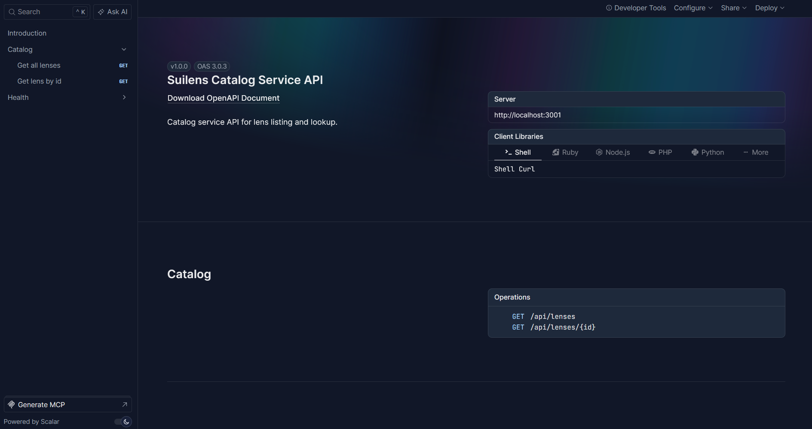
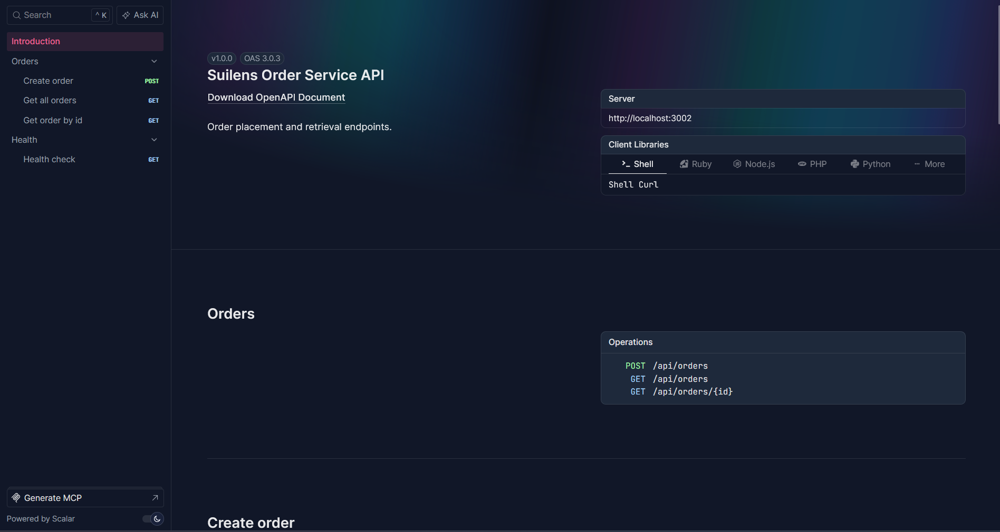
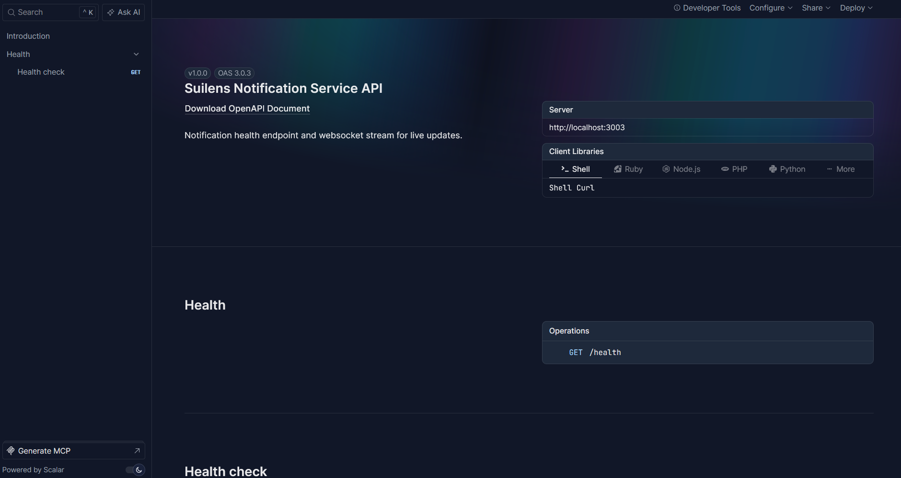
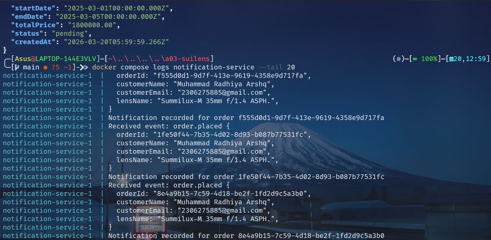
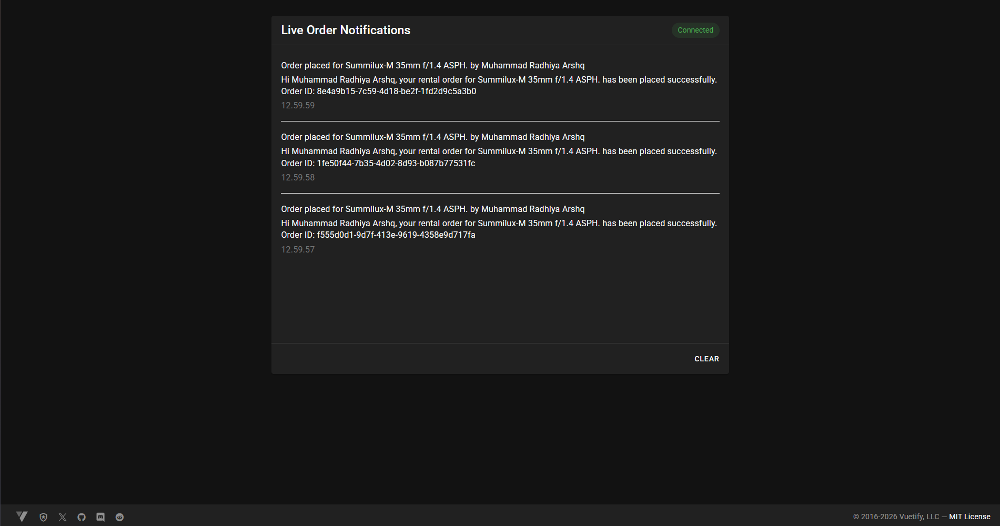
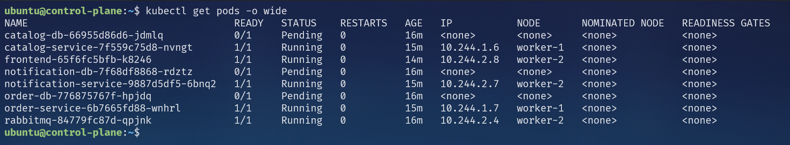

# Suilens API and Kubernetes Deployment

Nama : Muhammad Radhiya Arshq

NPM : 2306275885

Implementasi dokumentasi API dan cluster Kubernetes sederhana untuk skenario rental lensa kamera.

## Run

```bash
docker compose up --build -d
```

## Migrate + Seed (from host)

```bash
(cd services/catalog-service && bun install --frozen-lockfile && bunx drizzle-kit push)
(cd services/order-service && bun install --frozen-lockfile && bunx drizzle-kit push)
(cd services/notification-service && bun install --frozen-lockfile && bunx drizzle-kit push)
(cd services/catalog-service && bun run src/db/seed.ts)
```

## OpenAPI Documentation

After all services are running, open:

- Catalog Service: <http://localhost:3001/openapi>

- Order Service: <http://localhost:3002/openapi>

- Notification Service: <http://localhost:3003/openapi>


## WebSocket Notification API

- WebSocket endpoint: ws://localhost:3003/ws/notifications
- Frontend: <http://localhost:5173>

When a new order is created, frontend notification panel will receive the event in real-time.

## Smoke Test

`WSL`

```bash
curl http://localhost:3001/api/lenses | jq
LENS_ID=$(curl -s http://localhost:3001/api/lenses | jq -r '.[0].id')

curl -X POST http://localhost:3002/api/orders \
  -H "Content-Type: application/json" \
  -d '{
    "customerName": "Muhammad Radhiya Arshq",
    "customerEmail": "2306275885@gmail.com",
    "lensId": "'"$LENS_ID"'",
    "startDate": "2025-03-01",
    "endDate": "2025-03-05"
  }' | jq

docker compose logs notification-service --tail 20
```

`Powershell`

```bash
curl.exe http://localhost:3001/api/lenses | jq
$LENS_ID = (curl.exe -s http://localhost:3001/api/lenses | jq -r '.[0].id')
$json = @"
{
"customerName": "Muhammad Radhiya Arshq",
"customerEmail": "2306275885@gmail.com",
"lensId": "$LENS_ID",
"startDate": "2025-03-01",
"endDate": "2025-03-05"
}
"@
curl.exe -X POST http://localhost:3002/api/orders -H "Content-Type: application/json" -d $json | jq
docker compose logs notification-service --tail 20
```

### Hasil Smoke Test




## Stop

```bash
docker compose down
```

## Bukti Kubernetes

`kubectl get pods -o wide`

